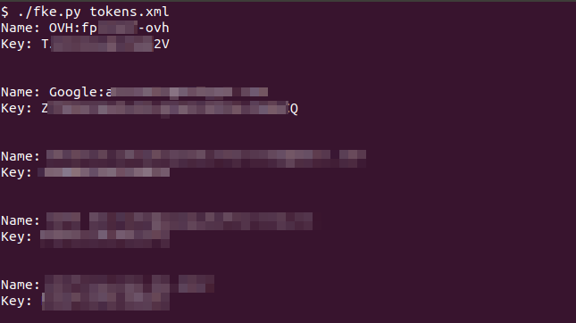

# FreeOTP Key Extractor

Extract TOTP BASE32 seeds from FreeOTP backup

# Screenshot



# Backup

`adb backup -f freeotp-backup.ab -apk org.fedorahosted.freeotp`

# Extract seeds

Require: https://github.com/nelenkov/android-backup-extractor


```
abe unpack freeotp-backup.ab freeotp-backup.tar

tar xvf freeotp-backup.tar

./fke.py apps/org.fedorahosted.freeotp/sp/tokens.xml
```
